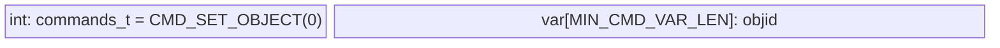
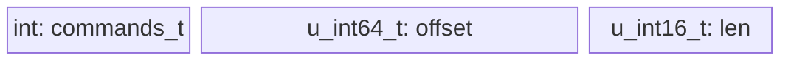

### Protocol draft

- TCP stateful connection
- Any request will have response frame before actual data transition (see `proto_resp_frame_t`)

#### commands:
(see `commands_t` enum)
- CMD_SET_OBJECT
- CMD_READ
- CMD_WRITE
- CMD_DISCARD

#### Auth + initialization
- First request should be `CMD_SET_OBJECT` (see `proto_basic_frame_t` struct)



#### IO requests
- See `proto_io_frame_t` struct




#### examples:
See `examples` folder
```bash
$ cd ./examples
$ make
$ ./ost-client 8080
Socket successfully created..
connected to the server..
Sent request to set objid, res:36
Response from Server: cmd:0 res:0
Read data?
Sent request read command, res:14
Response from Server: cmd:1 res:100
Response from Server data:
**The Project Gutenberg Etext of A Child's History of England**
#11 in our series by Charles Dicken
Retry?
```
