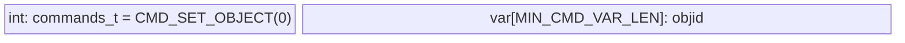

# Rawstor Object Storage Target (OST)

## Build requirements
Example for Debian:
```bash
apt install liburing-dev libxxhash-dev
```

## Run example:
```
# ost server
make
mkdir /tmp/objects
truncate -s 2G /tmp/objects/00000000-0000-7000-8000-000100000000
./src/ost 8080 /tmp/objects/

# qemu driver
sudo modprobe vduse virtio-vdpa
# run in separate session
sudo ./storage-daemon/qemu-storage-daemon \
  --blockdev '{"node-name":"test1","driver":"rawstor","object-id":"00000000-0000-7000-8000-000100000000","cache":{"direct":true,"no-flush":false},"discard":"unmap"}' \
  --export type=vduse-blk,id=test1,node-name=test1,name=test1,num-queues=16,queue-size=128,writable=true
sudo vdpa dev add name test1 mgmtdev vduse

# Example integrity test
fio --bs=4k --iodepth=128 --numjobs=4 --rw=write --name=test --ioengine=libaio --direct=1 --verify=sha1 --do_verify=1 --group_reporting=1 --filename=/dev/vda

# when finished
sudo vdpa dev del test1
```

## Protocol draft

- TCP stateful connection
- Any request will have response frame before actual data transition (see `proto_resp_frame_t`)

#### commands:
(see `commands_t` enum)
- CMD_SET_OBJECT
- CMD_READ
- CMD_WRITE
- CMD_DISCARD

#### Auth + initialization
- First request should be `CMD_SET_OBJECT` (see `proto_basic_frame_t` struct)



#### IO requests
- See `proto_io_frame_t` struct


#### examples:
See `examples` folder
```bash
$ cd ./examples
$ make
$ ./ost-client 8080
Socket successfully created..
connected to the server..
Sent request to set objid, res:36
Response from Server: cmd:0 res:0
Read data?
Sent request read command, res:14
Response from Server: cmd:1 res:100
Response from Server data:
**The Project Gutenberg Etext of A Child's History of England**
#11 in our series by Charles Dicken
Retry?
```
